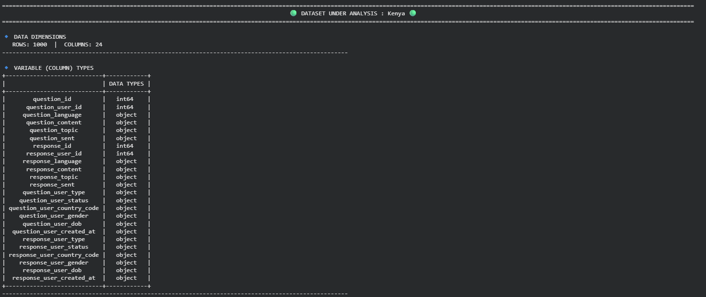
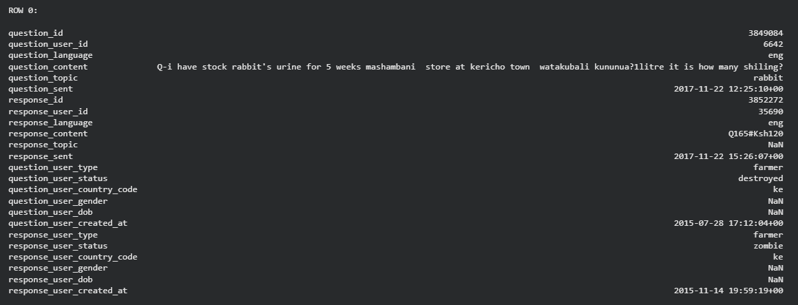
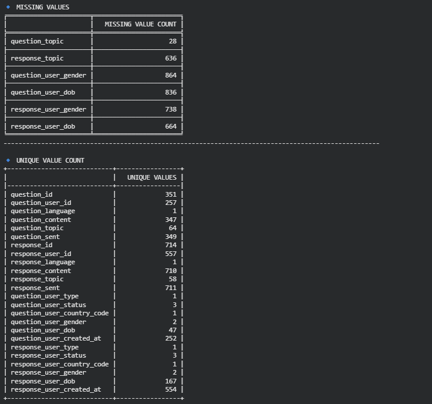
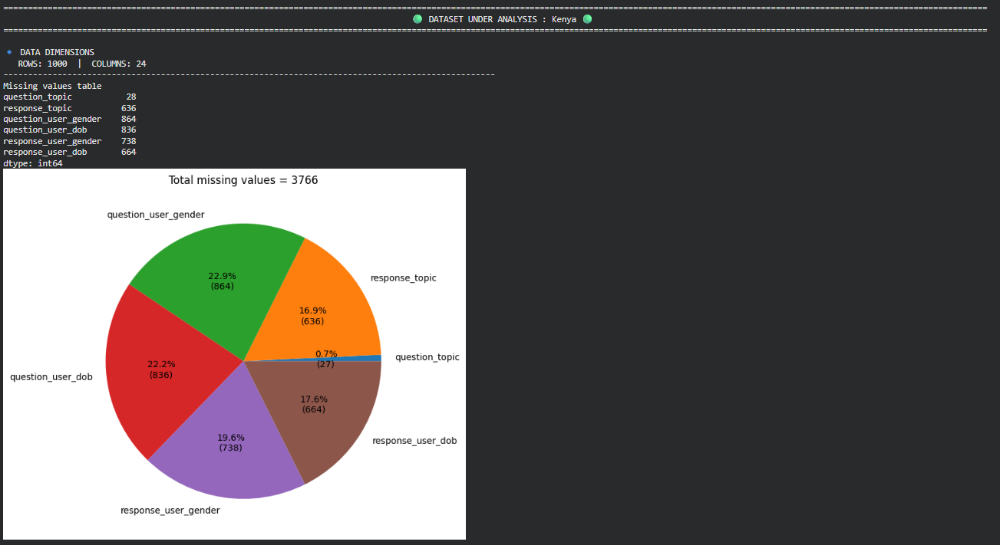
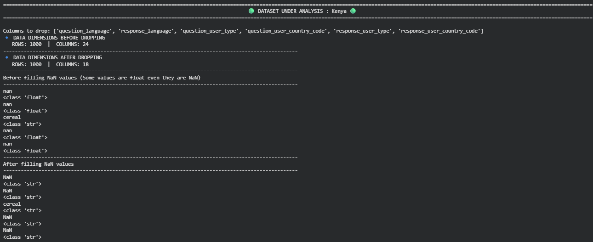
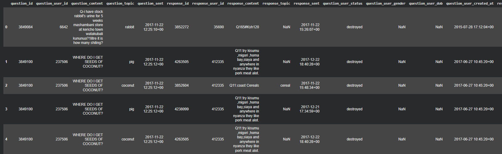
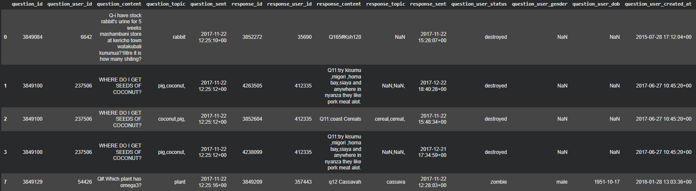

# Analyzing Eng Data And Specializing Countries
When i first saw the data i thought it would be better to analyze it in english. I think the other languages are also deserves a good analysis but the data is so big and when we take only eng data it's like half of the whole data.
I think every country must be analyzed specifically i mean if you analyzing all the countries together the statistics may fail so after making the data english i seperated them by countries. I also checked whether question and response countries are same or not and and except small amount of rows in GB they are all same.
(To understand data more quickly i only red 1000 rows of every countries' data)

## first_look() function
This function created to understand the data in more detail and it shows shape,data types,sample rows,unique and missing values

  

  <b>Dimensions and Data Types</b>

  

  <b>First Row</b>

  

  <b>Missing and Unique Values</b>

## detailed_missing_value_analysis() 
In order to analyze distribution of missing values in every country i prepared this function and it will also give insights for further dropping and analysis

  

  <b>Distribution of Missing Values</b>

## finding_unnecessary_cols()
It's so important to drop unnecessary columns because they may be waste of time, for instance some of the countries have 0 or 1 unique value in their columns and these columns can't give any usable information so we drop them

  

  <b>Filling NaN and Dropping Columns</b>

## making_rows_unique()
as you can see below some rows are same but the only difference is their question and response topics so it shows that if question user choose 3 topics and response user chose 2 different topics there will be 6 rows and it's unnecessary

  
  

  <b>Before</b> 🡒 <b>After</b>

You can see that before there was 2 different rows one of them has 'pig' as question topic and other 'coconut' after using this function it's now only 1 row and seperated by comma.

Actually this eda was more about having a more clear data to analyze because the data was too big in the beginning so as i continue to analyze i will add more insights and there will be improved version for challenge 5. But for not here you can find more efficient data
